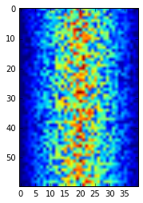
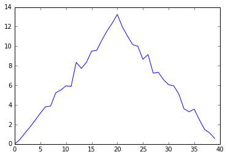
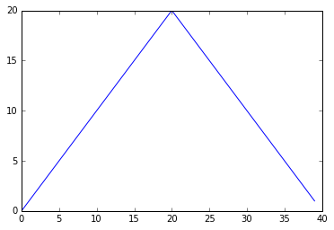
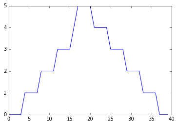

# Analyzing patient data

* Words are useful, but what’s more useful are the sentences and stories we build with them.
* A lot of powerful tools are built into languages like Python, even more live in the libraries they are used to build
* We need to **import** a library called NumPy
* Use this library to do fancy things with numbers (e.g. if you have matrices or arrays).


```python
import numpy
```

* Importing a library akin to getting **lab equipment** out of a locker and setting up on bench
* Libraries provide additional functionality
* With NumPy loaded we can read the CSV into python.


```python
#assuming the data file is in the data/ folder
numpy.loadtxt(fname='data/inflammation-01.csv', delimiter=',') 
```


    array([[ 0.,  0.,  1., ...,  3.,  0.,  0.],
           [ 0.,  1.,  2., ...,  1.,  0.,  1.],
           [ 0.,  1.,  1., ...,  2.,  1.,  1.],
           ..., 
           [ 0.,  1.,  1., ...,  1.,  1.,  1.],
           [ 0.,  0.,  0., ...,  0.,  2.,  0.],
           [ 0.,  0.,  1., ...,  1.,  1.,  0.]])


* numpy.loadtex() is a function call, runs loadtxt in `numpy`
* uses dot notation to access `thing.component`
* two parameters: filename and delimiter - both characters 
* we didn't save in memory using a variable 
* variables in python must start with letter & are case sensitive
* assignment operator is `=`
* let's look at assigning a single value to a variable 


```python
weight_kg = 55 #assigns value 55 to weight_kg
```


```python
print(weight_kg) #we can print to the screen
```

    55


```python
print('weight in pounds:', 2.2 * weight_kg) # do arithmetic with it
```

    weight in pounds: 121.00000000000001


```python
print?
```


```python
weight_kg = 57.5 #change variable's value by assign new value
print('weight in kilograms is now :', weight_kg)
```

    weight in kilograms is now : 57.5


* print above shows several things at once by separating with commas
* variable as putting sticky note on value
* means assigning a value to one variable does not chage the value of other variables. 


```python
weight_lb = 2.2 * weight_kg #example let's store patients weight in pounds
print('weight in kilograms: ', weight_kg, 'and in pounds', weight_lb)

```

    weight in kilograms:  57.5 and in pounds 126.50000000000001


```python
weight_kg = 100.0 #now change weight_kg
print('weight in kilograms is now:', weight_kg, 'and weight in pounds is still:', weight_lb)
```

    weight in kilograms is now: 100.0 and weight in pounds is still: 126.50000000000001


* `weight_lb` dosn't remember where its value came from
* it isn't automatically updated when `weight_kg` changes - not like spreadsheets

whos #ipython command to see what variables & mods you have

### What does each variable contain after each statement in the following program:

```python
mass = 47.5
age = 122
mass = mass * 2.0
age = age - 20
```

### What does the following program print out?

```python
first, second = 'Grace', 'Hopper'
third, fourth = second, first
print(third, fourth)
```


```python
whos
```

    Variable    Type      Data/Info
    -------------------------------
    numpy       module    <module 'numpy' from '/Us<...>kages/numpy/__init__.py'>
    weight_kg   float     100.0
    weight_lb   float     126.50000000000001


* we can also assign an array of values to a variable
* rerung `numpy.loadtxt` and save its result


```python
data = numpy.loadtxt(fname='data/inflammation-01.csv', delimiter=',') 
```


```python
print(data) #statement above doesn't produce output, let's pring
```

    [[ 0.  0.  1. ...,  3.  0.  0.]
     [ 0.  1.  2. ...,  1.  0.  1.]
     [ 0.  1.  1. ...,  2.  1.  1.]
     ..., 
     [ 0.  1.  1. ...,  1.  1.  1.]
     [ 0.  0.  0. ...,  0.  2.  0.]
     [ 0.  0.  1. ...,  1.  1.  0.]]


```python
print(type(data)) #we can get type of object
```

    <class 'numpy.ndarray'>


* data refers to N-dimensional array 
* data corres. to patients' inflammation
* let's look at the shape of the data


```python
print(data.shape)
```

    (60, 40)


* `data` has 60 rows and 40 columns 
* when we created data with numpy it also creates members or attributes
* extra info describes data like adjective does a noun
* dot notation to access members 


```python
print('first value in data', data[0,0]) #use index in square brackets
```

    first value in data 0.0


```python
data[30,20] # get the middle value - notice here i didn't use print
```


    13.0


* programming languages like MATLAB and R start counting at 1
* languages in C family (C++, Java, Perl & python)
* we have MxN array in python, indices go from 0 to M-1 on the first axis and 0 to N-1 on second
* indices are (row, column)


```python
data[0:4, 0:10] #select whole sections of matrix, 1st 10 days & 4 patients
```


    array([[ 0.,  0.,  1.,  3.,  1.,  2.,  4.,  7.,  8.,  3.],
           [ 0.,  1.,  2.,  1.,  2.,  1.,  3.,  2.,  2.,  6.],
           [ 0.,  1.,  1.,  3.,  3.,  2.,  6.,  2.,  5.,  9.],
           [ 0.,  0.,  2.,  0.,  4.,  2.,  2.,  1.,  6.,  7.]])


* slice 0:4 means start at 0 and go up to but not include 4
* up-to-but-not-including takes a bit of getting used to


```python
data[5:10,0:10]
```


    array([[ 0.,  0.,  1.,  2.,  2.,  4.,  2.,  1.,  6.,  4.],
           [ 0.,  0.,  2.,  2.,  4.,  2.,  2.,  5.,  5.,  8.],
           [ 0.,  0.,  1.,  2.,  3.,  1.,  2.,  3.,  5.,  3.],
           [ 0.,  0.,  0.,  3.,  1.,  5.,  6.,  5.,  5.,  8.],
           [ 0.,  1.,  1.,  2.,  1.,  3.,  5.,  3.,  5.,  8.]])


* dont' have to include uper and lower bound
* python uses 0 by default if we don't include lower
* no upper slice runs to the axis 
* `:` will include everything


```python
data[:3, 36:] 
```


    array([[ 2.,  3.,  0.,  0.],
           [ 1.,  1.,  0.,  1.],
           [ 2.,  2.,  1.,  1.]])


### A section of an array is called a slice. We can take slices of character strings as well:

```python
element = 'oxygen'
print('first three characters:', element[0:3])
print('last three characters:', element[3:6])
first three characters: oxy
last three characters: gen
```

**What is the value of element[:4]? What about element[4:]? Or element[:]?**

**What is element[-1]? What is element[-2]? Given those answers, explain what element[1:-1] does.**


```python
element = 'oxygen'
print('first three characters:', element[0:3])
print('last three characters:', element[3:6])
```

    first three characters: oxy
    last three characters: gen


```python
print(element[:4])
print(element[4:])
```

    oxyg
    en


```python
print(:)
```


      File "<ipython-input-7-83302cbc0a1f>", line 1
        print(:)
              ^
    SyntaxError: invalid syntax


```python
#oxygen
print(element[-1])
print(element[-2])
print(element[2:-1])
```

    n
    e
    yge


```python
doubledata = data * 2.0 #we can perform math on array
```


    ---------------------------------------------------------------------------

    NameError                                 Traceback (most recent call last)

    <ipython-input-13-76134479298d> in <module>()
    ----> 1 doubledata = data * 2.0 #we can perform math on array
    

    NameError: name 'data' is not defined


* operation on arrays is done on each individual element of the array


```python
doubledata
```


    array([[ 0.,  0.,  2., ...,  6.,  0.,  0.],
           [ 0.,  2.,  4., ...,  2.,  0.,  2.],
           [ 0.,  2.,  2., ...,  4.,  2.,  2.],
           ..., 
           [ 0.,  2.,  2., ...,  2.,  2.,  2.],
           [ 0.,  0.,  0., ...,  0.,  4.,  0.],
           [ 0.,  0.,  2., ...,  2.,  2.,  0.]])


```python
data[:3, 36:]
```


    array([[ 2.,  3.,  0.,  0.],
           [ 1.,  1.,  0.,  1.],
           [ 2.,  2.,  1.,  1.]])


```python
doubledata[:3, 36:]
```


    array([[ 4.,  6.,  0.,  0.],
           [ 2.,  2.,  0.,  2.],
           [ 4.,  4.,  2.,  2.]])


* we can also do arithmetic operation with another array of same shape (same dims)


```python
tripledata = doubledata + data 
```


```python
print('tripledata:')
print(tripledata[:3, 36:])
```

    tripledata:
    [[ 6.  9.  0.  0.]
     [ 3.  3.  0.  3.]
     [ 6.  6.  3.  3.]]


* we can do more than simple arithmetic
* let's take average inflammation for patients


```python
print(data.mean())
```

    6.14875


* mean is a method of the array (function)
* variables are nouns, methods are verbs - **they are what the thing knows how to do**
* for `mean` we need empty `()` parense even if we aren't passing in parameters to tell python to go do something
* `data.shape` doesn't need `()` because it's just a description 
* NumPy arrays have lots of useful methods:


```python
print('maximum inflammation: ', data.max())
print('minimum inflammation: ', data.min())
print('standard deviation:', data.std())
```

    maximum inflammation:  20.0
    minimum inflammation:  0.0
    standard deviation: 4.61383319712


* however, we are usually more interested in partial stats, e.g. max value per patient or the avg value per day
* we can create a new subset array of the data we want


```python
patient_0 = data[0, :] #0 on first axis, everythign on second
print('maximum inflammation for patient 0: ', patient_0.max())
```


    ---------------------------------------------------------------------------

    NameError                                 Traceback (most recent call last)

    <ipython-input-8-1da6c5d1f43f> in <module>()
    ----> 1 patient_0 = data[0, :] #0 on first axis, everythign on second
          2 print('maximum inflammation for patient 0: ', patient_0.max())


    NameError: name 'data' is not defined


* but we dont' need to create a smaller array, instead we can combine selection and method call:


```python
data[2, :].max() #max inflammation of patient 2
```


    19.0


* what if we need max inflammation for all patients, or the average for each day?

* most array methods let us specify the axis we want to work on


```python
print(data.mean(axis=0))
```

    [  0.           0.45         1.11666667   1.75         2.43333333   3.15
       3.8          3.88333333   5.23333333   5.51666667   5.95         5.9
       8.35         7.73333333   8.36666667   9.5          9.58333333
      10.63333333  11.56666667  12.35        13.25        11.96666667
      11.03333333  10.16666667  10.           8.66666667   9.15         7.25
       7.33333333   6.58333333   6.06666667   5.95         5.11666667   3.6
       3.3          3.56666667   2.48333333   1.5          1.13333333
       0.56666667]


```python
print(data.mean(axis=0).shape) #Nx1 vector of averages
```

    (40,)


```python
print(data.mean(axis=1)) #avg inflam per patient across all days
```

    [ 5.45   5.425  6.1    5.9    5.55   6.225  5.975  6.65   6.625  6.525
      6.775  5.8    6.225  5.75   5.225  6.3    6.55   5.7    5.85   6.55
      5.775  5.825  6.175  6.1    5.8    6.425  6.05   6.025  6.175  6.55
      6.175  6.35   6.725  6.125  7.075  5.725  5.925  6.15   6.075  5.75
      5.975  5.725  6.3    5.9    6.75   5.925  7.225  6.15   5.95   6.275  5.7
      6.1    6.825  5.975  6.725  5.7    6.25   6.4    7.05   5.9  ]


```python
print(data.mean(axis=1).shape)
```

    (60,)


* let's visualize this data with `matplotlib` library
* first we import the plyplot module from matplotlib


```python
import matplotlib.pyplot
```


```python
image = matplotlib.pyplot.imshow(data)
```





```python
matplotlib.pyplot.imshow?
```

* nice, but ipython/jupyter proved us with 'magic' functions and one lets us display our plot inline
* `%` indicates an ipython magic function 


```python
%matplotlib inline 
```


```python
numpy.mean?
```

now let's look at avg inflammation over days (columns) 


```python
ave_inflammation = data.mean(axis = 0)
ave_plot = matplotlib.pyplot.plot(ave_inflammation)
matplotlib.pyplot.show(ave_plot)
```





* avg per day across all patients in the var avg_inflamation
* matplotlib.pyplot create and display a line graph of those values
* results a linear rise and fall, which is suspicious 
* based on other studies we expect a sharper rise and slower fall
* let's look at two other stats


```python
max_plot = matplotlib.pyplot.plot(data.max(axis=0))
matplotlib.pyplot.show(max_plot)
```





```python
min_plot = matplotlib.pyplot.plot(data.min(axis=0))
matplotlib.pyplot.show(min_plot)
```





* max vals rise and falls smoothly, while min seems to be a step function
* neither seem likely 

* we can group into a single figure using subplots
* script below uses a number of new commands
* `matplotlib.pyplot.figure()` create the plotting space
* `figsize` tells python how big
* each plot is placed into the figure using `add_subplot` 
  - 1st val = how many rows, 2nd refers to the total number of subplot columns, 3rd denotes which plot you are referencing (left to right)
* each plot in a diff variable (axes1, axes2, axes3)
* we `set_xlabel()` & `set_ylabel` set the titles fo the axes 


```python
import numpy
import matplotlib.pyplot

data = numpy.loadtxt(fname='data/inflammation-01.csv', delimiter=',')

fig = matplotlib.pyplot.figure(figsize=(10.0, 3.0))

axes1 = fig.add_subplot(1, 3, 1)
axes2 = fig.add_subplot(1, 3, 2)
axes3 = fig.add_subplot(1, 3, 3)

axes1.set_ylabel('average')
axes1.plot(data.mean(axis=0))

axes2.set_ylabel('max')
axes2.plot(data.max(axis=0))

axes3.set_ylabel('min')
axes3.plot(data.min(axis=0))

fig.tight_layout()

matplotlib.pyplot.show()
```

    /Users/jtdennis/anaconda/envs/py35/lib/python3.5/site-packages/matplotlib/tight_layout.py:222: UserWarning: tight_layout : falling back to Agg renderer
      warnings.warn("tight_layout : falling back to Agg renderer")


### Create a plot showing the standard deviation (numpy.std) of the inflammation data for each day across all patients.


```python

```
